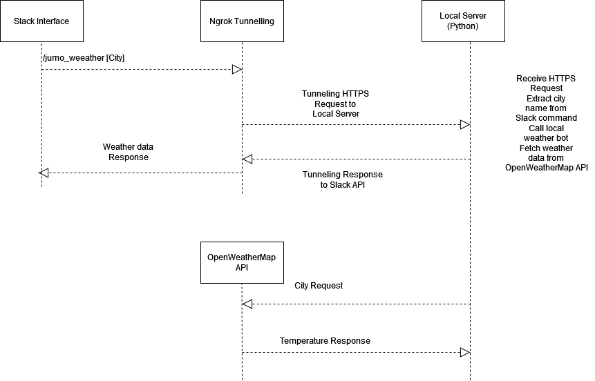

### system_design.md

#### Project Overview
The Weather Slack bot project aims to provide users with real-time weather information for a given city. Users interact with the bot through Slack slash commands, specifying the city for which they want to retrieve weather data.

#### Architecture
##### Architecture Diagram

The system architecture consists of the following components:
- **Slack Interface:** Provides a user interface for interacting with the Weather bot via Slack slash commands.
- **Ngrok:** Facilitates tunneling of traffic from Slack to the local server during development and testing phases.
- **Server:** Handles incoming requests from Slack, fetches weather data from the OpenWeatherMap API, and sends the response back to Slack.
- **OpenWeatherMap API:** External API used to retrieve weather data based on the provided city name.
- **Local Weather Bot:** Contains logic for processing requests, fetching weather data, and formatting responses.

The interaction flow is as follows:
1. User sends a slash command `/jumo_weather [city]` in Slack.
2. Slack forwards the request to Ngrok.
3. Ngrok tunnels the traffic to the local server.
4. The server extracts the city name from the request and calls the local weather bot to fetch weather data.
5. The local weather bot makes an API call to OpenWeatherMap to retrieve weather information for the specified city.
6. Weather data is processed and formatted into a response message.
7. The server sends the response back to Slack through Ngrok, which is then displayed to the user..

#### Tools and Technologies
- **Programming Language:** Python
- **Web Framework:** HTTP server for handling Slack requests
- **External API:** OpenWeatherMap API for weather data
- **Local Tunneling:** Ngrok for tunneling local server to the internet during development
- **Version Control:** Git
- **Communication Platform:** Slack

#### Algorithm and Code Explanation
The main algorithm involves fetching weather data from the OpenWeatherMap API based on the provided city name. The fetch_weather() function in weather.py handles this task. It constructs the API request URL with the city name and makes an HTTP GET request to retrieve weather data. The response is then parsed to extract the temperature information.

**Algorithm:**
1. Construct the API request URL with the city name.
2. Make an HTTP GET request to the OpenWeatherMap API to fetch weather data.
3. Parse the JSON response to extract the temperature information.
4. Return the temperature in Celsius.

**Pseudocode:**
api_key = 'APIID FROM OPENWEATHERMAP'
url = 'http://api.openweathermap.org/data/2.5/weather?q=' + city + '&units=metric&APPID=' + api_key

try:
    response = HTTP_GET(url)
    data = PARSE_JSON(response)
    temperature = data['main']['temp']
    return temperature
except Exception as e:
    PRINT('Error fetching weather data:', e)
    return None

#### Secure Handling of API Keys
API keys are stored securely and not exposed in the codebase.

#### Validation of User Input
The server performs input validation to ensure only valid city names are processed.

#### Secure Communication
HTTPS is used for communication between the server and external APIs.

#### Testing Strategy
- **Unit tests:** Test individual components such as the `fetch_weather()` function to ensure they work as expected.
- **Integration tests:** Test the interaction between different components, such as the server handling requests from Slack and fetching weather data from the API.
- **End-to-end tests:** Test the entire system flow, simulating user interactions with the Slack bot and verifying the response.

#### Exploration of APIs
We extensively explored the OpenWeatherMap API and Slack API to understand their functionalities and responses. This exploration guided our development process, helping us build a robust and efficient Weather Slack bot. We utilized tools like Postman to directly hit the OpenWeatherMap API and observed the responses. Additionally, we inspected Slack API responses by adding print statements in our code to understand the data format received from Slack slash commands.

This exploration process played a crucial role in designing our system architecture, implementing request handling logic, and formatting responses to ensure seamless integration between Slack and OpenWeatherMap APIs.

#### Future Improvements
- Implement caching mechanisms to reduce the number of API calls to OpenWeatherMap.
- Add support for more advanced weather queries, such as weather forecasts.
- Enhance error handling to provide more informative responses to users in case of failures.
- Implement user authentication to restrict access to the Slack bot.
- Explore natural language processing techniques to improve the bot's understanding of user queries.

#### Conclusion
The Weather Slack bot provides a convenient way for users to access real-time weather